<!-- ===================== HEADER ===================== -->

  

<h2 align="center">
  
</h2>

  &nbsp;
  &nbsp;
  

---

## 🧠 About Me

> **Agentic AI Engineer** specializing in end-to-end LLM systems, RAG pipelines, and distributed backend infrastructure. Pre-final year CSE student at **SRMIST Trichy** pursuing **BTech Honours in Quantum Computation**, currently **ML Engineer Intern at ALKF, Hong Kong (Remote)**.

- 🚀 Building production-grade autonomous AI systems — not just notebooks
- 🏆 **SIH '25 National Winner** (₹1,50,000) · **AIR 62 / 6,223** at Amazon ML Challenge 2025
- 🔗 Bridging AI, backend infrastructure, computer vision, and embedded hardware
- 📄 Research presented at **ICETETM'25** (International Conference) · **CGPA: 9.667**

---

## 📊 GitHub Dashboard

<!-- ROW 1: Profile Stats + Streak -->

  
  &nbsp;
  

<!-- ROW 2: Top Languages + Activity Graph -->

  

<!-- ROW 3: Activity Graph full width -->

  

---

## 🏅 Achievements & Trophies

  

---

## ⚙️ Core Skills & Technologies

<table width="100%" align="center">
<tr>
<td width="25%" valign="top">

### 🤖 Agentic AI & LLMs

</td>
<td width="25%" valign="top">

### 🛠️ Backend & Infrastructure

</td>
<td width="25%" valign="top">

### 👁️ AI / ML & Computer Vision

</td>
<td width="25%" valign="top">

### ⚡ Embedded, Quantum & Geospatial

</td>
</tr>
</table>

---

### 💻 Languages & Data

---

## 🏆 Achievements & Events

| Event | Outcome | Prize / Recognition |
|-------|---------|---------------------|
| 🥇 **Smart India Hackathon 2025** | **National Winner** — first SRMIST Trichy team in 5 years | ₹1,50,000 |
| 🎯 **Amazon ML Challenge 2025** | **AIR 62 / 6,223 teams** | All-India Rank |
| 🚀 **Edu Tantr 12-Hour Hackathon** | **Top 5 / 981 teams** — National Finalist | Internship Offer |
| 🏆 **DigiGreen National Hackathon** | **4th Place / 556+ teams** | Certificate of Recognition |
| 🥇 **ProtoThon 1.0 – SRM IST** | **Winner** | ₹5,000 |
| 🥇 **Algo Vault – YUVA Techfest** | **Winner** | ₹5,000 |
| 📄 **ICETETM'25 – International Conference** | Research Paper Presented | International |
| ⚙️ **INNOV FEST '24 – SRM IST** | Project Deployment | Institutional |
| 🔥 **HackXtreme 2025** | 24-Hour Hackathon | Participation |

---

## 🚀 Featured Projects

| Project | Description | Stack | Recognition |
|---------|-------------|-------|-------------|
| **[Applivo](https://github.com/Sudharsanselvaraj/Applivo-Distributed-Opportunity-Application-Orchestration-System)** | Autonomous AI career agent — scrapes jobs, LLM analysis, ATS resume gen, auto-apply | FastAPI · PostgreSQL · Redis · Celery · ChromaDB · OpenAI · Playwright | Production-grade |
| **[ALKF Master Land Plan API](https://github.com/Sudharsanselvaraj/ALKF-Master-Land-Plan-API)** | Geospatial API for lot ID → spatial intelligence, boundary sampling, view/noise analysis | Python · OpenCV · DXF · Geospatial | ALKF Internship |
| **[OrbitXOS](https://github.com/Sudharsanselvaraj/OrbitXOS)** | Real-time space debris & satellite tracking across LEO/MEO/GEO with collision forecasting | Python · 3D Earth Viz · Orbital Mechanics | Top 5 / 981 teams |
| **[PERSEUS-Net](https://github.com/Sudharsanselvaraj/PERSEUS-Net-Perception-Environment-Reasoning-System)** | Perception-Environment-Reasoning autonomous system | Python | Pinned |
| **[Tracenox](https://github.com/Sudharsanselvaraj/Tracenox-Towards-Adaptive-Cybersecurity-using-Hybrid-Deep-Learning-and-FSM-Models)** | Adaptive cybersecurity using hybrid deep learning + FSM models | Python · Deep Learning | Pinned |
| **[WQ Vision](https://github.com/Sudharsanselvaraj/wqvision-testing-kit)** | AI water quality kit — colorimetric strip analysis via ESP32-CAM | OpenCV · FastAPI · ESP32-CAM | 🥇 Protothon 1.0 |
| **[GHG-FuseNet](https://github.com/Sudharsanselvaraj/GHG-API)** | Real-time GHG forecasting — CO₂ R²=0.94, NO₂ R²=0.89 | NASA FIRMS · FastAPI · Random Forest | 🏆 4th / 556 teams |
| **[Legal Contract Analyzer](https://github.com/Sudharsanselvaraj/Legal-Contract-Analyzer-using-Zero-Shot-LLM-inference-and-semantic-Embedding-)** | Zero-shot LLM + semantic embedding clause risk scoring | XGBoost · TF-IDF · PyMuPDF | — |
| **[FroSense](https://github.com/Sudharsanselvaraj/Frosense-Intelligence)** | AI cold storage system with IoT + solar-battery optimization | ESP32 · FastAPI · Sensor Fusion | HackXtreme 2025 |
| **[Autonomous Proctoring](https://github.com/Sudharsanselvaraj/Autnomous-Real-Time-Proctoring-via-Cross-Modal-Gaze-and-Pose-Encoding-using-Vision-Transformers)** | Cross-modal gaze + pose encoding via Vision Transformers | YOLOv8 · MediaPipe · ViT · PyTorch | — |

---

## 💼 Experience

| Role | Company | Period | Type |
|------|---------|--------|------|
| 🤖 **ML Engineer Intern** | ALKF, Hong Kong | Jan 2026 – Present | Remote |
| ⚛️ **Quantum Computation Intern** | NIT Trichy | Jun 2025 – Jul 2025 | On-site |
| 🤖 **Robotics Software Engineer** | Persist Ventures, SF | Dec 2024 – Feb 2025 | Remote |
| 📊 **Data Analyst** | Indika AI, Bengaluru | Jul 2024 – Sep 2024 | Remote |

---

## 🎓 Education

| Degree | Institution | Period | Grade |
|--------|-------------|--------|-------|
| ⚛️ **BTech Honours — Quantum Computation** | SRMIST, Trichy | Jan 2025 – May 2027 | 'O' Grade |
| 💻 **BTech CSE** | SRMIST, Trichy | Sep 2023 – Mar 2027 | **9.667 CGPA** |

---

## 📈 GitHub Metrics

### Overview

  

### Isometric Commit Calendar

  

### Stargazers World Map

  

### LeetCode

  

### Achievements

  

---

<!-- ===================== FOOTER ===================== -->

  

  

  <i>⚡ "Building the future, one model at a time." — Sudharsan S</i>

